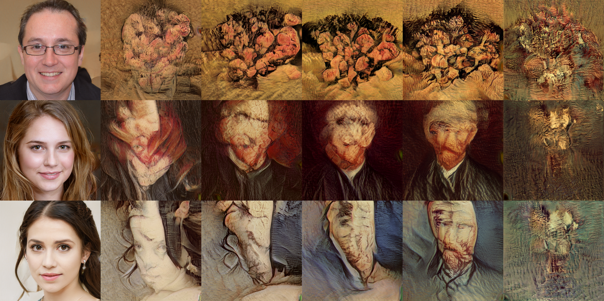
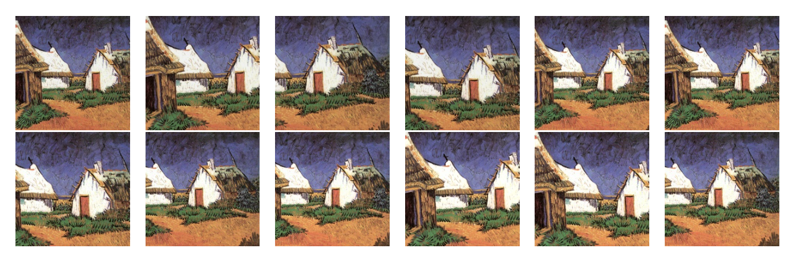

# Making Art with Generative Adversarial Networks
Deep Learning (20/21) `WMAI017-05.2020-2021.2A`


<small>Note: these are **not** real people: these were generated using a [StyleGAN](https://github.com/NVlabs/stylegan). We retrained the network to generate paintings instead of faces.</small>

Tries painting new Van Gogh's using [Generative Adversarial Networks](https://arxiv.org/abs/1406.2661). See our [report](<Making Art with Generative Adversarial Networks.pdf>). We also built a small [demo](https://dunnkers.com/generative-adversarial-networks) with TensorFlow.js, where you can generative images in your browser yourself ✨.

## Dataset
To download the [dataset](https://www.kaggle.com/ipythonx/van-gogh-paintings) on either your computer or on Peregrine:

1. Follow the setup from the [official Kaggle API repo](https://github.com/Kaggle/kaggle-api#api-credentials). Make sure `~/.kaggle/kaggle.json` exists.

2. Execute

```shell
pip install kaggle
data_dir=./dataset
kaggle datasets download -p $data_dir ipythonx/van-gogh-paintings
unzip -n $data_dir/van-gogh-paintings.zip -d $data_dir
```

The dataset will now be available in `data_dir` 💪🏻.

→ in the case of Peregrine, it is recommended to set `data_dir` to somewhere in `/data/<s_number>/`.

### Data augmentation
Although Van Gogh was a very productive painter, training a GAN still requires some more images. Follow the relevant instructions in the `dcgan` directory to augment the dataset. Augmentation will adjust image- brightness, shearing, cropping, resizing and adding random noise. Example of an augmented images:



## Training
Training can be done with DCGAN or StyleGAN. See `dcgan` for instructions on training DCGAN, and `stylegan` for instructions on training StyleGAN.

_Note_: The `ppgn` directory contains code for the Plug and Play network and is there for archival purposes; it is something we eventually decided to discontinue.

## About
By Loran Knol, Elisa Oostwal, Thijs Havinga and [Jeroen Overschie](https://dunnkers.com).
